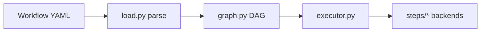

# ai_watcher architecture

This document describes how the MVP is structured and where to extend it (for example **issue sources** and new step types).

## High-level flow



1. **Load & validate**: [`load.py`](../src/ai_watcher/load.py) reads YAML with PyYAML and validates with Pydantic models in [`schema.py`](../src/ai_watcher/schema.py).
2. **Graph checks**: [`graph.py`](../src/ai_watcher/graph.py) ensures top-level steps form a **DAG** (no cycles). Each `repeat` step has its own **inner** DAG validated separately.
3. **Execute**: [`executor.py`](../src/ai_watcher/executor.py) walks the top-level topological order. For `repeat`, it runs the inner order in a bounded loop until `until` matches or `max_iterations` is reached.
4. **Step backends**: [`steps/`](../src/ai_watcher/steps/) implement `command`, `script`, `copilot_sdk`, and `external_cli` using subprocess or the async Copilot SDK.

## Runtime context

[`context.py`](../src/ai_watcher/context.py) holds `RunContext`: current working directory, prompt text, optional prompt file path, captured per-step outputs, and named `outputs` for template keys. Templates are rendered by [`templates.py`](../src/ai_watcher/templates.py) using `{{ dotted.path }}` lookups—no arbitrary code execution.

## Repeat vs cycles

The main workflow graph is **acyclic**. Iteration is modeled only through explicit **`repeat`** steps with `max_iterations`, not through cyclic edges. This keeps scheduling and human editing predictable.

## Extension: issue sources (future)

The MVP passes work via CLI prompt only. A small protocol in [`issues.py`](../src/ai_watcher/issues.py) documents the intended hook:

```python
class IssueSource(Protocol):
    async def next_item(self) -> dict[str, Any] | None: ...
    def describe(self) -> str: ...
```

Future versions could:

- Implement `IssueSource` for GitHub Issues, webhooks, or queues.
- Map each item into `RunContext.prompt` (and metadata) before calling `execute_workflow`.

## Extension: new step types

1. Add a Pydantic model in `schema.py` with a new `type` literal and add it to `InnerStep` / `TopLevelStep` unions.
2. Implement an async runner in `steps/`.
3. Dispatch in `executor._dispatch_executable`.
4. Add tests under `tests/` with `ExecutionHooks` mocks.

## Testing strategy

- **Unit**: graph cycle detection, topological order, template rendering, schema errors.
- **Executor**: async tests with `ExecutionHooks` overriding step runners (no real subprocess or Copilot).
- **CLI**: subprocess-free tests calling `main()` with `--dry-run` or validation errors.

## Dependency boundaries

| Layer | Depends on |
|-------|------------|
| `schema`, `templates`, `graph` | stdlib + Pydantic |
| `steps/*` | `RunContext`, schema, subprocess / `github-copilot-sdk` |
| `executor` | graph, steps, context |
| `reporting` | `ExecutionResult` / `StepResult` (for CLI summary output) |
| `cli` | load, executor, reporting |

This keeps parsing and graph logic testable without installing Copilot or external CLIs.
